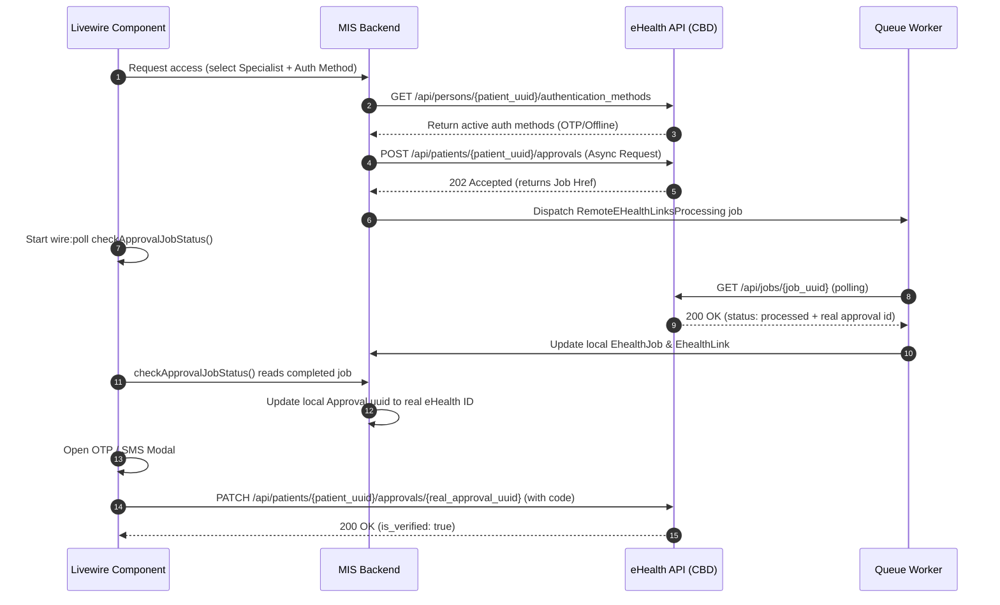

# eHealth Approvals (Consent) Integration Architecture

This document describes how the application interacts with the Ukraine eHealth (ESOZ) Approvals (Consent) API, detailing the flows, endpoints, payloads, and common troubleshooting steps encountered during development.

---

## 1. Core Concept: Care Plan vs. Approval (Consent)

In the eHealth ecosystem, patient medical records and care plans are protected resources. Access to these resources is managed using **Attribute-Based Access Control (ABAC)** and explicit consents (Approvals).

*   **Care Plan Registration**: When a Care Plan is created, it is registered in the eHealth Central Database (CBD) and transitions to an `active` status.
*   **The Access Block**: Even if a Care Plan is `active`, any doctor or medical specialist who attempts to read or write activities (service requests) for this plan will be blocked with a **`403 Forbidden: Access denied`** error unless one of the following is true:
    1.  The clinician's legal entity has an **active declaration** with the patient.
    2.  The clinician has been granted and has verified a specific **Approval (Consent)** resource for this Care Plan.
*   **Implicit vs. Explicit Consent**: If a doctor does not have an active declaration, they must request an explicit approval from the patient. This approval must be verified by the patient via a 2-factor authentication code (OTP/SMS) or an offline document signature.

---

## 2. The Creation & Verification Flow

Below is the step-by-step technical workflow for requesting, polling, and verifying an eHealth Approval.



### Step 1: Get Auth Methods
To determine how the patient can authorize the request, the system retrieves the patient's registered authentication methods:
*   **HTTP Method**: `GET`
*   **Endpoint**: `/api/persons/{patient_uuid}/authentication_methods`
*   **Controller Reference**: [CarePlanApprovals.php](file:///wsl.localhost/Ubuntu/home/mefizz/projects/ohealth/app/Livewire/CarePlan/CarePlanApprovals.php#L69-L70)

### Step 2: Create Approval (Async 202)
An approval is requested for a specific Care Plan resource to be granted to a specific Employee:
*   **HTTP Method**: `POST`
*   **Endpoint**: `/api/patients/{patient_uuid}/approvals`
*   **Controller Reference**: [CarePlanApprovals.php](file:///wsl.localhost/Ubuntu/home/mefizz/projects/ohealth/app/Livewire/CarePlan/CarePlanApprovals.php#L170-L180)
*   **Request Payload**:
```json
{
  "resources": [
    {
      "identifier": {
        "type": {
          "coding": [
            {
              "system": "eHealth/resources",
              "code": "care_plan"
            }
          ]
        },
        "value": "354877e1-73c6-4221-afa0-753a12808850"
      }
    }
  ],
  "granted_to": {
    "identifier": {
      "type": {
        "coding": [
          {
            "system": "eHealth/resources",
            "code": "employee"
          }
        ]
      },
      "value": "ac5b2c8e-35fa-489d-b5ef-733005dca33d"
    }
  },
  "access_level": "write",
  "authorize_with": "3509f0bc-ebab-45bf-93eb-81a40d5c3e95"
}
```
*   **Response**: `202 Accepted` with a job link in the headers/body. The application creates a local `Approval` record with a temporary random UUID and links it to an `EhealthLink` tracking the job.

### Step 3: Poll Job Status
A background queue worker polls the async job status until it reaches a terminal state:
*   **HTTP Method**: `GET`
*   **Endpoint**: `/api/jobs/{job_uuid}`
*   **Job Reference**: [RemoteEHealthLinksProcessing.php](file:///wsl.localhost/Ubuntu/home/mefizz/projects/ohealth/app/Jobs/RemoteEHealthLinksProcessing.php)
*   **Standardized Mapping Correction**:
    Once the job status becomes `PROCESSED`, the Livewire component's `checkApprovalJobStatus()` method extracts the real approval UUID from the job's `response_data` and updates both the database record and the component state to resolve potential `404` errors during verification:
```php
$realApprovalId = $jobResult['response_data']['id'] ?? $jobResult['data']['id'] ?? null;
if ($realApprovalId) {
    $link->linkable->update(['uuid' => $realApprovalId]);
    $this->approvalId = $realApprovalId;
}
```

### Step 4: Verify Approval (OTP / Offline)
Once the job completes and the real approval ID is mapped, the user inputs the 4-digit OTP code to verify the consent:
*   **HTTP Method**: `PATCH`
*   **Endpoint**: `/api/patients/{patient_uuid}/approvals/{real_approval_uuid}`
*   **Payload**:
```json
{
  "code": 1234
}
```
*   **API Class Reference**: [Approval.php](file:///wsl.localhost/Ubuntu/home/mefizz/projects/ohealth/app/Classes/eHealth/Api/Approval.php#L79-L82)

### Step 5: Resend SMS
If the SMS code is lost or expired, the clinician can request a resend:
*   **HTTP Method**: `POST`
*   **Endpoint**: `/api/approvals/{approval_uuid}/actions/resend`
*   **API Class Reference**: [Approval.php](file:///wsl.localhost/Ubuntu/home/mefizz/projects/ohealth/app/Classes/eHealth/Api/Approval.php#L92-L101)
*   **Fallback Endpoint**: If the primary endpoint returns a `404`, the client automatically falls back to: `/api/patients/{patient_uuid}/approvals/{approval_uuid}/actions/resend`.

---

## 3. Common Errors & Troubleshooting

| Error Code / Behavior | Probable Cause | Resolution |
| :--- | :--- | :--- |
| **`422 Invalid employee type`** | The approval is requested for an employee with type `OWNER` or `HR`. | eHealth only permits granting clinical approvals to **`DOCTOR`** or **`SPECIALIST`** roles. Restrict the dropdown options to query only these types in the database. |
| **`authentication_method_current: null`** | The patient does not have an active declaration with the legal entity. | In the preprod eHealth sandbox, if no active declaration exists, the SMS gateway bypasses actual SMS delivery and requires the mock code **`1234`** for verification. |
| **`403 Access denied` on Activity creation** | The clinician lacks a verified write approval. | Ensure that the approval flow has been fully completed and `is_verified` is marked as `true` in eHealth for the performing specialist. |
| **`403 Forbidden` / `/api/patients`** | Access control rule mismatch on SMS resend. | Ensure the fallback endpoint in `Approval.php` is correctly utilized to handle routing variants across preprod environments. |
