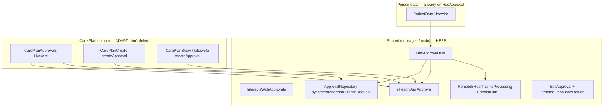

# Gap Analysis: Care Plan Approvals vs Shared Approvals Architecture

**Date**: 2026-07-17  
**Branches compared**: `fork/main` (upstream) vs `origin/i267_i365_i367_care_plan_stack` ([PR #489](https://github.com/openhealths/nationHealth/pull/489))  
**Status**: Analysis only — no code changes in this pass  
**Goal**: Adapt Care Plan flows to shared approvals infrastructure without rewriting working create plan / activities.

---

## 1. Official API (canonical)

| Action | Doc | Contract |
|--------|-----|----------|
| **List / sync** | [Get approvals](https://e-health-ua.atlassian.net/wiki/spaces/EH/pages/2115600961/Get+approvals) | `GET /api/patients/{patient_id}/approvals` · scope `approval:read` · filters: `granted_to`, `granted_resources`, `granted_resource_type`, `status`, `access_level`, paging |
| **Resend OTP** | [Resend SMS on Approval](https://e-health-ua.atlassian.net/wiki/spaces/EH/pages/583403110/Resend+SMS+on+Approval) | `…/patients/{id}/approvals/{id}/actions/resend` · scope `approval:create` · Confluence: **PATCH** (stack currently **POST** — verify on UAT) |
| **Create** | CSI-1323 Create approval | `POST /api/patients/{id}/approvals` · async 202 common |
| **Verify** | (verify API) | `PATCH /api/patients/{id}/approvals/{id}` with OTP |

**Sync in MIS** = Get approvals (+ optional filters for `care_plan`) → persist locally. Not a separate “Sync” endpoint.

---

## 2. Two layers (both already on stack + main)

| Layer | Primary consumer | Purpose |
|-------|------------------|---------|
| **Shared** | `PatientData` via `HasApproval` | Generic create → format payload → local Approval → eHealth → sync/async job batch |
| **Care Plan UI** | `CarePlanApprovals` + inline create on Create/Show | Domain UX: employee DOCTOR/SPECIALIST, `resources=care_plan`, `access_level` write/read, OTP poll |

`HasApproval.php` and `InteractsWithApprovals.php` are **identical** on main and stack.  
Stack **adds** care-plan-specific maturity: richer `CarePlanApprovals`, `syncApprovals()`, fixed `resendSms`, tests, architecture doc.

---

## 3. What each create path does today

### 3.1 Shared `HasApproval::createApproval(Model $model, $payloadData)`

- Auth: `ApprovalPolicy` + blocks `OFFLINE` auth method.
- Payload: `ApprovalRepository::formatEHealthRequest()` (supports `resources`, `granted_to`, `access_level`, …).
- **URL patient id = `$model->uuid`** — correct when `$model` is **Person** (`PatientData`).
- Async: `EhealthJob` + `EhealthLink` + `Bus::batch(RemoteEHealthLinksProcessing)` + user notification.
- Sync response: `Repository::approval()->sync(...)`.

**Cannot drop Care Plan into this as-is:**

| Risk | Why |
|------|-----|
| Wrong patient in URL | If `$model` were `CarePlan`, `$model->uuid` = care_plan id → **invalid** for `POST /patients/{patient_id}/approvals` |
| OFFLINE forbidden | Care plan flows may need offline auth in some clinics |
| Default access `read` | Care plan same-LE needs **`write`** |
| Approvable binding | Designed around person-data / granted_resources lookup on `$model` |

### 3.2 Care Plan paths (stack) — working domain pattern

| Entry | Patient URL | Resource | granted_to | access_level | Async handling |
|-------|-------------|----------|------------|--------------|----------------|
| `CarePlanApprovals::createApproval` | `patientUuid` | `care_plan` | selected employee | write if same LE else read | provisional Approval + `attachEhealthLink` + batch + **Livewire poll UUID swap** |
| `CarePlanCreate::createApproval` | `patientUuid` | `care_plan` | writer employee | write | same pattern |
| `CarePlanShow` / `ManagesCarePlanLifecycle` | person uuid | `care_plan` | employee | write | similar; **bug**: `app(App\Repositories\ApprovalRepository::class)` — class missing, should be MedicalEvents repo |

### 3.3 Main `CarePlanApprovals` (stub)

Still asks `granted_to_legal_entity_id` + flat reason — **wrong** vs eHealth (employee grant + FHIR `resources`). Stack fixed this; main did not get the full Care Plan Approvals lift until PR #489 merges.

---

## 4. Sync comparison

| | Shared `sync()` | Stack `syncApprovals($entity, $resourceType)` |
|--|-----------------|-----------------------------------------------|
| Trigger | After create response / job processed | Explicit refresh from Care Plan Approvals UI |
| API | Uses response body | **Get approvals** `getPatientApprovals($patientUuid)` then **client-side filter** by resource |
| Persist | Relational granted_* via `sync()` | Mongo raw + SQL `updateOrCreate` (parallel path) |

**Gap vs Confluence Get approvals:** server-side filters `granted_resource_type=care_plan` + `granted_resources={uuid}` exist; stack mostly fetches list then filters in PHP. Prefer API filters when adapting.

---

## 5. Resend comparison

| Branch | Implementation |
|--------|----------------|
| main | Broken fallback: `POST /api/approvals/approvals/{id}/…` then PATCH patient path |
| stack | `POST /api/patients/{id}/approvals/{id}/actions/resend` (+ tests) |
| Confluence | Same path, method **PATCH** |

**Action later:** align HTTP method with UAT/Apiary; keep patient-scoped path only.

---

## 6. Duplication / consistency issues (priority)

| ID | Severity | Issue | Recommendation |
|----|----------|-------|----------------|
| G1 | **HIGH** | 3–4 parallel `createApproval` copies (Approvals / Create / Show / Lifecycle) | Extract **one** Care Plan approval service/adapter that uses shared repo + API; Livewire only orchestrates UX |
| G2 | **HIGH** | `HasApproval` assumes Person uuid in URL | Do **not** `use HasApproval` on CarePlan model unchanged; add adapter: `(CarePlan $plan, payload) → createApproval($plan->person->uuid, …)` + `approvable = CarePlan` |
| G3 | **HIGH** | `CarePlanShow` references missing `App\Repositories\ApprovalRepository` | Point to `MedicalEvents\Repository::approval()` / `syncApprovals` |
| G4 | **MEDIUM** | Two persist styles: `sync()` vs `syncApprovals()` Mongo+SQL | Prefer one write path (`sync()` from shared) fed by Get approvals list; keep Mongo if still required for audit |
| G5 | **MEDIUM** | Async UX: HasApproval = notify-only; Care Plan = Livewire poll + OTP modal | Keep Care Plan poll/OTP (clinician must verify to continue); reuse job/link persistence from shared |
| G6 | **MEDIUM** | `HasApproval` bans OFFLINE; care plan may need it | Policy decision: allow OFFLINE only on Care Plan adapter |
| G7 | **LOW** | Resend POST vs PATCH | Confirm on preprod; one client method |
| G8 | **LOW** | Main stub Approvals UI | Goes away when #489 merges; until then don't build on main stub |

---

## 7. Recommended adaptation strategy (phased, no rush)

### Phase A — Inventory & stabilize (read/fix only)

1. On **PR #489 stack** (working baseline): confirm create plan + activities still green.
2. Fix **G3** (wrong repository class) as surgical fix.
3. Document which Livewire entry points create approvals (table above).

### Phase B — Shared infrastructure alignment

1. Keep `HasApproval` for **PatientData** unchanged.
2. Introduce thin **`CarePlanApprovalService`** (or extend repository) that:
   - builds FHIR care_plan payload (`formatEHealthRequest` already supports `resources`);
   - calls `createApproval($patientUuid, …)` with **person** uuid;
   - creates local Approval with `approvable = CarePlan`;
   - attaches `EhealthLink` / reuses `RemoteEHealthLinksProcessing` like HasApproval;
   - exposes verify / resend using shared API client.
3. Point `CarePlanApprovals`, Create, Show/Lifecycle at that service (delete duplicate payload builders).
4. `fetchApprovals` / sync: `getPatientApprovals` with **query filters** from Get approvals doc, then `sync()`.

### Phase C — Do not do yet

- Rewrite create care plan / activity sign.
- Force Care Plan through raw `HasApproval::createApproval($carePlan, …)`.
- Big-bang delete of CarePlanApprovals UI.

---

## 8. Mapping to Spec Kit tasks (US2 reframed)

| Old task framing | Better framing |
|------------------|----------------|
| “Implement approvals from scratch” | **Adapt** Care Plan to shared ApprovalRepository + API; preserve Care Plan UX |
| T022 create/poll/verify | Route through CarePlanApprovalService; keep poll/OTP |
| T025 declaration implicit | Align with clarify B (author until 403) + shared access checks |
| T021 resend | Documented patient path; method PATCH/POST per UAT |

US1 create plan polish stays **secondary** to US2 adaptation if create already works.

---

## 9. Open questions (for later clarify / UAT — not blocking analysis)

1. Resend: PATCH (Confluence) vs POST (stack) — what does preprod accept?
2. Should Care Plan allow OFFLINE authorize_with (HasApproval currently forbids)?
3. After job completes, is Livewire poll mandatory or is notification + manual refresh enough for Approvals tab?
4. Does Get approvals with `granted_resource_type` + `granted_resources` work on current eHealth env (prefer over client filter)?

---

## 10. Verdict

| Statement | Assessment |
|-----------|------------|
| Colleague built a general approvals architecture | **Yes** — `HasApproval` + `ApprovalRepository` + jobs; used by PatientData |
| Care Plan should be rewritten onto HasApproval blindly | **No** — patient uuid / write / OFFLINE / approvable mismatch |
| Care Plan stack Approvals are “bad architecture” | **No** — domain layer is stronger than main stub; needs **convergence** onto shared repo/API/jobs |
| Create plan / activities | Treat as **working**; only touch approval side-effects |
| Next engineering step | Phase A surgical G3 + gap checklist on stack; then Phase B service extraction |

**PR to work against:** [#489](https://github.com/openhealths/nationHealth/pull/489) `Mefizz:i267_i365_i367_care_plan_stack`.
