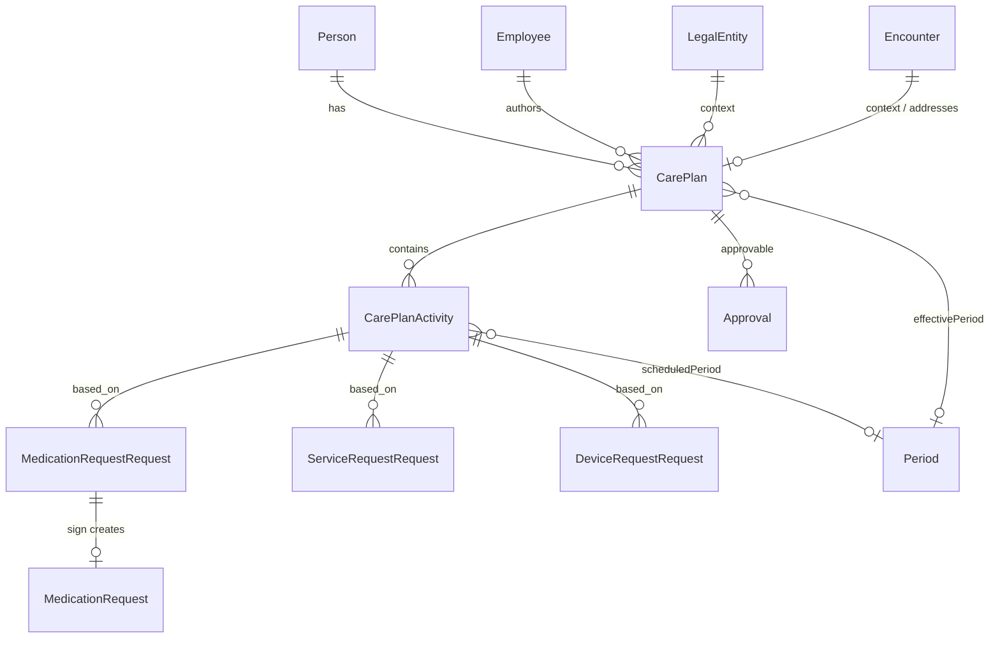

# Data Model: Care Plans Domain

## Entity Relationship

## CarePlan

| Field | Notes |
|-------|-------|
| id | Local PK |
| uuid | eHealth id after register |
| person_id / patient ref | Required |
| employee_id | Author |
| legal_entity_id | LE context |
| status | draft/new/active/on-hold/completed/revoked/entered-in-error/… |
| terms_of_service | PROVIDING_CONDITION coding — **must persist** |
| category, intent, description, note | Per CBD |
| inform_with | Auth method for patient notify |
| clinical_protocol | **Local only** — never send to CBD |
| context | Encounter reference |
| addresses | Diagnoses from encounter |
| supporting_info | Episodes / medical records |
| effectivePeriod | Synced from CBD after create |

**Transitions**: draft → (sign) new|active → complete|cancel; new may activate via approval flow.

## CarePlanActivity

| Field | Notes |
|-------|-------|
| uuid | eHealth activity id |
| care_plan_id | FK |
| kind | service_request \| medication_request \| device_request |
| status | draft / scheduled / in-progress / … |
| product_reference | Service / medication / device |
| program / quantity / daily amounts | Program limits |
| do_not_perform | Flag |
| timing / scheduledPeriod | When relevant |

## Approval

| Field | Notes |
|-------|-------|
| uuid | Real eHealth id after job |
| approvable | Morph → CarePlan |
| granted_to (employee) | DOCTOR/SPECIALIST only |
| access_level | read \| write |
| is_verified | After OTP/offline |
| auth method | From person authentication methods |

## MedicationRequestRequest / MedicationRequest

| Layer | Statuses |
|-------|----------|
| MRR | NEW → SIGNED \| REJECTED \| EXPIRED |
| MR | ACTIVE → COMPLETED \| REJECTED \| EXPIRED |

Key: `based_on` [care_plan, activity], `medication_id`, program, period, dosage_instruction, intent, category, context.

## ServiceRequestRequest / DeviceRequestRequest

Local draft → signed active document; cancel → entered-in-error (per current referral model). Device always prequalify when program-bound.

## Validation rules (cross-entity)

1. Plan sign requires finished eHealth encounter + non-empty addresses.
2. Author employee_role.providing_condition matches terms_of_service.
3. Issue document requires activity uuid in eHealth + plan active + consent.
4. Medication order requires prequalify VALID.
5. Reject reasons from System dictionaries only.
