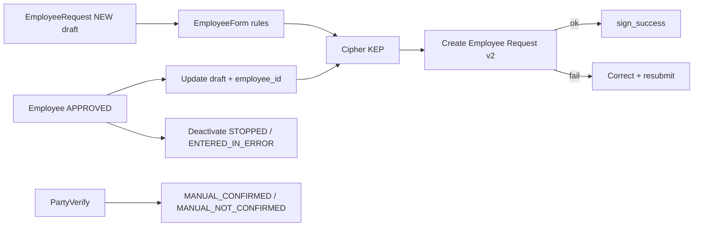

# Implementation Plan: ESОЗ 3.23 Employee Records

**Feature**: `002-esoz-3-23-employee-records`  
**Branch**: `i485_i486_i487_esoz_employee_party_uat`  
**Date**: 2026-07-17

## Approach

Do **not** rewrite the Employee module. Systematize existing flows and close FR-GAP-* with minimal diffs.

### Existing flow (keep)

### Gap fix order (recommended)

1. **FR-GAP-323-LOCK-UI** — bind `isCorePositionDataLocked` in `position.blade.php` / start_date fields.
2. **FR-GAP-323-DIVISION-LOCK** — stop locking division via `isPositionDataLocked` on EmployeeEdit.
3. **FR-GAP-323-INVITE-MSG** — extend `employees.sign_success` (or dedicated key) with invitation wording.
4. **FR-GAP-323-SHOW-MEDICAL** — gate show blocks on `config('ehealth.medical_employees')`.
5. **FR-GAP-323-PREVIEW** — optional read-only summary step before signature modal.
6. **FR-GAP-323-EMP-FILTERS** / **REQ-ID** — list UX.
7. **FR-GAP-323-OFFICIO-ONE** — require exactly one primary speciality.
8. **FR-GAP-323-STATUS-MODEL** — land/merge #493 keep-NEW after sign.
9. **FR-GAP-323-OWNER-FALLBACK** — align policy with OWNER/PHARMACY_OWNER.

## Technical notes

- Prefer helpers on `EmployeeRequest` (`isLocalDraft` / `isPendingEhealth`) if merging #493.
- Do not remap `RequestStatus::SIGNED->label()` to «Новий» without fixing status model.
- Keep death API reasons as `MANUAL_CONFIRMED` / `MANUAL_NOT_CONFIRMED` (already on branch).

## Test strategy

- PHPUnit: form locks, speciality_officio count, sign_success translation key presence.
- Manual UAT: `quickstart.md` checklist against PRIMARY_CARE + OUTPATIENT.
